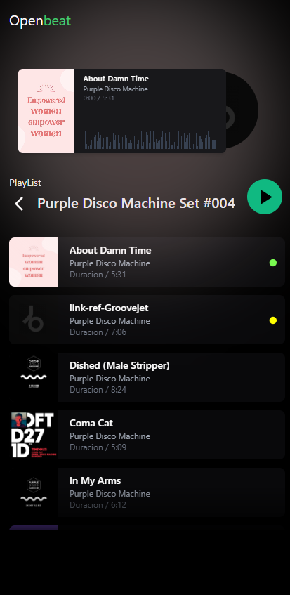

# Open Beat



Open Beat es una aplicación de DJ moderna e inteligente que utiliza tecnologías de inteligencia artificial para mejorar la experiencia de mezcla de música. La aplicación ofrece análisis de audio avanzado, detección de BPM, transiciones inteligentes entre canciones y más.

## Características

- **Interfaz de DJ intuitiva**: Carrusel de canciones y artistas para una navegación fácil
- **Análisis de audio con IA**: Procesamiento avanzado de audio utilizando TensorFlow.js y Magenta
- **Detección automática de BPM**: Identifica automáticamente el tempo de las canciones
- **Transiciones inteligentes**: Crea transiciones suaves entre canciones
- **Análisis emocional**: Analiza el contenido emocional de la música
- **Gestión de metadatos**: Extrae y gestiona metadatos de archivos de música
- **Visualización de carátulas**: Muestra las carátulas de los álbumes

## Tecnologías utilizadas

- **Frontend**: Angular 20
- **Estilos**: Tailwind CSS
- **Audio**:
  - Howler.js para reproducción de audio
  - Tone.js para síntesis y procesamiento de audio
  - Music-metadata para análisis de metadatos
- **Inteligencia Artificial**:
  - TensorFlow.js para procesamiento de audio con IA
  - Magenta para generación y análisis musical
  - Essentia.js y Meyda para análisis de audio
  - ML-Matrix para operaciones matriciales

## Requisitos previos

- Node.js (versión 18 o superior)
- npm (versión 9 o superior)

## Instalación

1. Clona el repositorio:
   ```
   git clone https://github.com/tu-usuario/open-beat.git
   cd open-beat
   ```

2. Instala las dependencias:
   ```
   npm install
   ```

3. Inicia la aplicación en modo desarrollo:
   ```
   npm start
   ```

4. Abre tu navegador y visita `http://localhost:4200`

## Compilación para producción

Para compilar la aplicación para producción:

```
npm run build
```

Los archivos compilados se encontrarán en el directorio `dist/`.

## Pruebas

Para ejecutar las pruebas unitarias:

```
npm test
```

## Estructura del proyecto

- `src/app/dj/` - Componentes de la interfaz de DJ
- `src/app/home/` - Componentes de la página principal
- `src/app/services/` - Servicios para procesamiento de audio, análisis y reproducción
