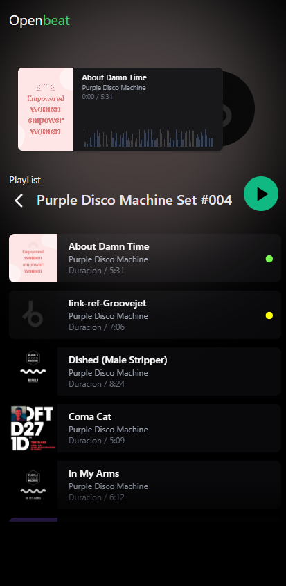

# Open Beat



Open Beat es una aplicación de DJ moderna e inteligente que utiliza tecnologías de inteligencia artificial para mejorar la experiencia de mezcla de música. La aplicación ofrece análisis de audio avanzado, detección de BPM, transiciones inteligentes entre canciones y más.

## Características

- **Interfaz de DJ intuitiva**: Carrusel de canciones y artistas para una navegación fácil
- **Análisis de audio con IA**: Procesamiento avanzado de audio utilizando TensorFlow.js y Magenta
- **Detección automática de BPM**: Identifica automáticamente el tempo de las canciones
- **Transiciones inteligentes**: Crea transiciones suaves entre canciones
- **Análisis emocional**: Analiza el contenido emocional de la música
- **Gestión de metadatos**: Extrae y gestiona metadatos de archivos de música
- **Visualización de carátulas**: Muestra las carátulas de los álbumes
- **Lector biónico**: Librero con libros en PDF y lector tipo Kindle con formato de lectura biónica

## Lector biónico (biblioteca)

Además del modo DJ, Open Beat incluye un lector de libros con **lectura biónica**: la primera parte de cada palabra se muestra en negrita para que la vista salte entre puntos de fijación y el cerebro complete el resto, lo que permite leer más rápido y con menos esfuerzo.

- **Librero** (`/biblioteca`): un estante con tres libros de dominio público en español (Project Gutenberg): *Vida de Lazarillo de Tormes* (anónimo, 1554), *Marianela* (Benito Pérez Galdós, 1878) y *Cuentos de amor, de locura y de muerte* (Horacio Quiroga, 1917). Al tocar un libro se abre el lector; el progreso de lectura se muestra sobre la portada.
- **Añadir PDF**: el último hueco del estante permite abrir cualquier PDF propio. Se guarda en el navegador (IndexedDB) y aparece en el librero en las siguientes visitas.
- **Lector** (`/leer/:id`): aspecto tipo Kindle. El texto del PDF se extrae con [pdf.js](https://mozilla.github.io/pdf.js/), se reconstruyen párrafos, títulos y subtítulos (también los cortados entre páginas) y se pagina en pantallas completas capítulo a capítulo. Se pasa de página deslizando el dedo (o arrastrando con el ratón), con el deslizamiento horizontal de la app de Kindle, tocando los bordes, con las flechas del teclado o con la barra de progreso.
- **Ajustes (Aa)**: activar o desactivar el formato biónico y su intensidad (baja, media, alta); fuentes Literata, Lexend, Atkinson Hyperlegible o la del sistema; tamaño, interlineado, tema (blanco, sepia, verde, oscuro), luz cálida y pantalla completa. La posición de lectura y los ajustes se recuerdan.
- **Índice**: lista de capítulos detectados en el PDF (con subtítulos) para saltar entre ellos.
- **Tiempo restante**: estimación de minutos para acabar el capítulo y el libro, a partir del ritmo real de lectura medido con cada página.
- **Leer en voz alta**: síntesis de voz del navegador con resaltado del párrafo y de la palabra que se está leyendo, velocidad y voz configurables.
- **Modo ráfaga**: lectura palabra a palabra (RSVP) con la letra de fijación resaltada y velocidad ajustable de 100 a 800 palabras por minuto; al salir, el lector queda donde se detuvo.
- **Subrayados y notas**: al seleccionar texto (arrastrando con el ratón o con pulsación larga en el móvil) aparece una barra para subrayar en cuatro colores, añadir una nota o copiar. Tocar un subrayado permite cambiarle el color, editar la nota o quitarlo. La pestaña "Notas" del índice lista todos y salta a cada uno. Se guardan en el navegador por libro.
- **Diccionario**: con una sola palabra seleccionada, "Definir" consulta el Wikcionario en español y muestra sus acepciones (requiere conexión).
- La pantalla no se apaga mientras se lee (Wake Lock) en los navegadores que lo permiten.

**Versión autónoma (un solo archivo).** `node scripts/build-standalone.mjs` genera `dist/standalone/librero-bionico.html`: el librero y el lector sin Angular, con el texto de los tres libros ya extraído y pdf.js incrustado, listo para publicar en cualquier sitio estático o abrir directamente desde el disco.

**App para Android (APK).** La carpeta `android/` contiene el proyecto Capacitor que empaqueta el lector como app nativa. Además de "Añadir PDF", la app busca libros en el teléfono: el botón "Buscar en el teléfono" lista los PDF de Descargas, Documentos y una carpeta `Libros` para elegir cuáles añadir, y con la opción "Añadir solos los PDF nuevos" se incorporan automáticamente al abrir la app. En Android 11 o superior pide el permiso "Acceso a todos los archivos" (necesario para leer documentos guardados por otras apps). Para compilar:

```
node scripts/build-standalone.mjs --app   # genera dist/android-www
npx cap sync android
cd android && ./gradlew assembleDebug     # android/app/build/outputs/apk/debug/app-debug.apk
```

Requiere JDK 21 y el SDK de Android (API 36). El flujo de GitHub Actions `Android APK` compila el APK en cada push y lo deja como artefacto descargable de la ejecución.

Los PDFs de `src/assets/books/` se generan a partir de las ediciones de texto de Project Gutenberg con `node scripts/build-books.js` (requiere red y Playwright con Chromium).

## Tecnologías utilizadas

- **Frontend**: Angular 20
- **Estilos**: Tailwind CSS
- **Audio**:
  - Howler.js para reproducción de audio
  - Tone.js para síntesis y procesamiento de audio
  - Music-metadata para análisis de metadatos
- **Lectura**: pdf.js (pdfjs-dist) para extraer el texto de los PDFs
- **Inteligencia Artificial**:
  - TensorFlow.js para procesamiento de audio con IA
  - Magenta para generación y análisis musical
  - Essentia.js y Meyda para análisis de audio
  - ML-Matrix para operaciones matriciales

## Requisitos previos

- Node.js (versión 18 o superior)
- npm (versión 9 o superior)

## Instalación

1. Clona el repositorio:
   ```
   git clone https://github.com/tu-usuario/open-beat.git
   cd open-beat
   ```

2. Instala las dependencias:
   ```
   npm install
   ```

3. Inicia la aplicación en modo desarrollo:
   ```
   npm start
   ```

4. Abre tu navegador y visita `http://localhost:4200`

## Compilación para producción

Para compilar la aplicación para producción:

```
npm run build
```

Los archivos compilados se encontrarán en el directorio `dist/`.

## Pruebas

Para ejecutar las pruebas unitarias:

```
npm test
```

## Estructura del proyecto

- `src/app/dj/` - Componentes de la interfaz de DJ
- `src/app/home/` - Componentes de la página principal
- `src/app/services/` - Servicios para procesamiento de audio, análisis y reproducción
